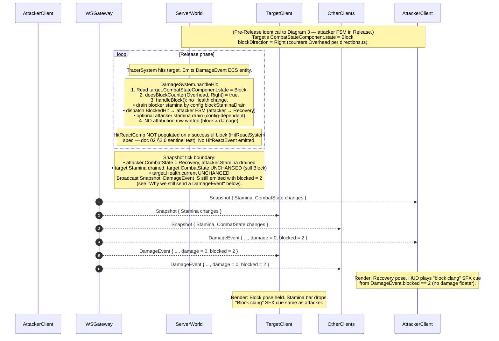

# 03 — Sequence Diagrams & Anti-Cheat Baseline

> **Status:** architecture spec, no production code change. This is sub-issue
> 3 of 4 under the multiplayer parent (#92). Doc 04 (server runtime, deploy)
> takes everything below as given.
>
> **Scope:** end-to-end client/server flow diagrams (join, move, swing,
> hit-blocked, disconnect/reconnect) and the per-message server-side
> validation rules behind doc 01 §6.
>
> **Out of scope for this doc** (covered elsewhere): transport / authority
> split (#116 / doc 01), wire byte layout & message-type enum (#126 / doc
> 02), Node.js entry point and Docker layout (#138 / doc 04), statistical
> aimbot / wall-hack heuristics, DDoS mitigation, encrypted payloads beyond
> TLS-on-WS, client-side script-injection prevention, demo replay.

---

## 0. Reading order

This doc references docs 01 and 02 by section number throughout. The
diagrams use the protocol message names fixed in doc 02 §3 verbatim
(`ClientHello`, `Welcome`, `InputFrame`, `Snapshot`, `EntitySpawned`,
`EntityDespawned`, `PlayerJoined`, `PlayerLeft`, `WeaponSwapRequest`,
`PickupRequest`, `WeaponPickupEvent`, `WeaponDropEvent`, `DamageEvent`,
`DeathEvent`, `HitReactEvent`, `GoldDelta`, `Disconnect`). Read doc 02 §3
before this doc — the field names below are not redefined.

The actors are the same in every diagram:

| Actor          | Role                                                                                          |
| -------------- | --------------------------------------------------------------------------------------------- |
| `Client`       | The local browser tab — Three.js render, ECS prediction world, `InputManager`, HUD.            |
| `WSGateway`    | Server-side WebSocket handler. Per-connection. Validates frames, rate-limits, drains into the inbound queue. **Does not mutate ECS state directly.** |
| `ServerWorld`  | Headless server-side `GameWorld` — bitECS world + Rapier physics + per-player FSMs. Single instance, single arena, 60 Hz fixed-update loop (doc 01 §2). |
| `OtherClients` | All connected peers other than the one being diagrammed. Receives the same broadcasts as `Client` for any state that's not local-only. |

> **GitHub Mermaid rendering note.** Every diagram below is fenced as
> ```` ```mermaid ```` and uses `sequenceDiagram` syntax. GitHub renders
> these natively — no extra tooling. `Note over X: …` is used for tick
> annotations and decision branches; `loop` blocks express multi-tick
> windup/release/recovery phases. Each protocol message is shown as a
> single arrow with the message name in `monospace`; payload fields are
> referenced inline only when the diagram needs them to be unambiguous.

---

## 1. Diagram 1 — Join flow

A client opens a WebSocket and is brought up to steady-state. The full
handshake (with byte layouts and `DisconnectReason` codes) is in doc 04;
this diagram shows the **shape**, not the bytes.

```mermaid
sequenceDiagram
    autonumber
    participant Client
    participant WSGateway
    participant ServerWorld
    participant OtherClients

    Note over Client: User clicks "Join". TLS-WS upgrade.
    Client->>WSGateway: WS upgrade (TLS, binaryType=arraybuffer)
    WSGateway-->>Client: HTTP 101 Switching Protocols
    Note over WSGateway: TCP+TLS established. No app logic yet.

    Client->>WSGateway: ClientHello { protocolVersion, displayName, clientNonce }
    Note over WSGateway: Validate protocolVersion against server's PROTOCOL_VERSION (doc 02 §6.4).
    alt version mismatch
        WSGateway->>Client: Disconnect { reason = PROTOCOL_VERSION_MISMATCH }
        WSGateway-->>Client: WS close
        Note over WSGateway: Connection terminal. Client surfaces "Update your client".
    else version ok
        WSGateway->>ServerWorld: spawnPlayer(displayName) → eid
        Note over ServerWorld: selectSpawnPoint() (src/world/SpawnPoints.ts);<br/>create ECS entity, install components, register sessionToken=clientNonce.
        ServerWorld-->>WSGateway: { eid, fullSnapshot, serverTick }
        WSGateway->>Client: Welcome { clientEid, serverTick, ownedWeapons,<br/>starterWeaponId, fullSnapshot, players[] }
        Note over Client: Build local ECS world from fullSnapshot.<br/>Register Three.js meshes for every entry.<br/>Request pointer lock on next user gesture.

        WSGateway->>OtherClients: PlayerJoined { eid, displayName }
        WSGateway->>OtherClients: EntitySpawned { eid, type=Player, fullState }
        Note over OtherClients: Allocate mesh + nameplate for the new player.

        Client->>WSGateway: InputFrame { client_tick = 0,<br/>last_received_snapshot_tick = serverTick, ... }
        Note over WSGateway: Steady-state begins. Subsequent ticks follow Diagram 2.
    end
```

### What this diagram pins

- `Welcome` is **always the first** S→C message after a successful
  `ClientHello` (doc 02 §3.5). The client MUST NOT process any other S→C
  message before `Welcome` lands; if a `Snapshot` arrives first, the
  client MUST log and disconnect (treat as PROTOCOL_PARSE_ERROR).
- The client's first `InputFrame` carries
  `last_received_snapshot_tick = Welcome.serverTick`. That value seeds
  the per-client snapshot baseline (doc 02 §2.4).
- `EntitySpawned` for the new player is broadcast to other clients
  **before** the new client itself receives its `Welcome` is not a
  guarantee — but it MUST be sent within the same server tick.
- `PlayerJoined` arrives **before** the first `Snapshot` that contains
  the new entity (doc 02 §3.5).
- The `clientNonce` from `ClientHello` is stashed on the server-side
  per-connection record as `sessionToken: u128` and re-used for
  reconnect identity (Diagram 5).

---

## 2. Diagram 2 — Move flow with prediction & reconciliation

A WASD step on the client. Movement is the prediction boundary (doc 01
§4.2). The diagram shows one input tick `T` round-tripping through the
server and back, and how the client reacts to the resulting snapshot.

For readability, RTT is collapsed to a single network arrow; in practice
each direction has its own latency. The `last_processed_input_tick`
(doc 02 §3.2 `Snapshot`) is the load-bearing field that lets the client
know which prediction frame to compare against.

```mermaid
sequenceDiagram
    autonumber
    participant Client
    participant WSGateway
    participant ServerWorld

    Note over Client: Tick T (client clock).<br/>Capture WASD + camera; build InputFrame.
    Note over Client: Predict locally:<br/>1. Append (T, predicted_position) to ring buffer (size 60).<br/>2. Run MovementSystem with this tick's intent.<br/>3. Local mesh moves immediately.
    Client->>WSGateway: InputFrame { client_tick = T, last_received_snapshot_tick = S_prev,<br/>keys, mouse_dx/dy, camera_yaw, camera_pitch, ... }

    Note over WSGateway: Receive at t = T + uplink_latency.<br/>Rate-limit (§5.3), monotonicity check (§5.4),<br/>append to per-client inbound queue.<br/>NO ECS mutation here.

    Note over ServerWorld: Server tick T_srv (>= T + uplink_latency / FIXED_TIMESTEP).<br/>Drain inbound queue at top of fixedUpdate.
    Note over ServerWorld: For this client's frame:<br/>1. Speed-hack check (§5.2).<br/>2. Camera-pitch clamp (§5.6).<br/>3. State-aware filter (§5.10): if FSM in HitStun/Stunned, drop<br/>Attack/Block transitions; movement still applied.<br/>4. Run MovementSystem with the validated intent.

    Note over ServerWorld: Snapshot tick boundary (every other server tick = 30 Hz).<br/>Build Snapshot with last_processed_input_tick = T<br/>and the player's authoritative Position.
    ServerWorld->>WSGateway: snapshot ready
    WSGateway-->>Client: Snapshot { tick = T_srv, last_processed_input_tick = T,<br/>entries: [{ playerEid, changedMask, position, ... }] }

    Note over Client: Reconciliation (doc 01 §5).<br/>Look up ring-buffer entry at tick T:<br/>delta = | snapshot.position − buffer[T].predicted_position |.

    alt delta < 0.05 m  (no correction)
        Note over Client: Discard buffer entries ≤ T. No render change.
    else delta < 0.5 m  (smooth-correct)
        Note over Client: Set ECS Position to snapshot value.<br/>Apply (server_pos − client_pos) as a render-only mesh offset<br/>that decays linearly to zero over 100 ms (6 ticks).<br/>Replay all buffered InputFrames (T+1 .. now) on the corrected base.
    else delta ≥ 0.5 m  (hard snap)
        Note over Client: Set ECS Position to snapshot value.<br/>Reset render mesh to that position (no offset).<br/>Replay all buffered InputFrames (T+1 .. now) on the new base.
    end

    Note over Client: Tick T+1 (and forward): keep predicting,<br/>buffering new frames at the head of the ring.
```

### What this diagram pins

- The client's prediction is **append-only** — it never waits for the
  server before moving the local mesh.
- The server treats `InputFrame.client_tick` as a **monotonic logical
  clock**. The first violation of monotonicity drops the frame
  (§5.4); the server's own simulation tick (`T_srv` here) is unrelated
  to the client's tick number.
- Smooth-correct sets the **authoritative ECS `Position`** to the
  snapshot value immediately. The visual mesh offset is render-only —
  any other system that reads `Position` (e.g. tracer math, when the
  player ever swings, which is server-authoritative anyway) sees the
  corrected value on the next tick.
- The replay step re-runs `MovementSystem` only. No combat, no tracer,
  no damage — those are server-authoritative and already canonical in
  the snapshot stream.
- The 0.05 / 0.5 m thresholds are the same constants as doc 01 §5.2 and
  are not tunable per-player.

---

## 3. Diagram 3 — Swing flow

A successful unblocked attack. Tick numbers flow from the moment the
client presses LMB through the server's CombatSystem → TracerSystem →
DamageSystem → HealthSystem chain (doc 01 §4.4) and back to all clients.

```mermaid
sequenceDiagram
    autonumber
    participant Client
    participant WSGateway
    participant ServerWorld
    participant OtherClients

    Note over Client: Tick T (client). LMB pressed; mouse-flick window resolves<br/>attack_direction_hint = Overhead (doc 01 §3.1 Option A).<br/>Camera yaw/pitch sampled.<br/>Client does NOT enter Windup locally — combat is server-authoritative.
    Client->>WSGateway: InputFrame { tick=T, mouse_buttons.LMB=1,<br/>attack_direction_hint = Overhead, camera_yaw, camera_pitch, ... }

    Note over ServerWorld: Server tick T_srv. Drain inbound; validate enum (§5.7);<br/>FSM is in Idle and accepts Overhead → CombatSystem.<br/>fsm.transition(Attack, Overhead) ⇒ Windup.<br/>CombatStateComponent marked dirty (doc 02 §2.3).

    loop Windup phase  (T_srv .. T_srv + windupTicks)
        Note over ServerWorld: FSM ticks. _ticksRemaining decrements.<br/>No tracer — TracerSystem early-outs unless state == Release.<br/>30 Hz snapshots include CombatStateComponent.state = Windup.
    end

    Note over ServerWorld: At T_srv + windupTicks, FSM auto-transitions Windup → Release.<br/>(CombatFSM.ts:340 _onTimerExpired). CombatStateComponent dirty again.

    loop Release phase  (every server fixed tick while state == Release)
        Note over ServerWorld: TracerSystem.processReleaseEntity(eid):<br/>sweep tracer points between previous and current bone-world<br/>positions; query Rapier sensor intersections against hitbox<br/>colliders. On intersection, emit DamageEvent ECS entity.
        Note over ServerWorld: DamageSystem (next tick of same fixedUpdate) drains the<br/>DamageEvent: target FSM not in Block/ParryWindow,<br/>so this is an unblocked hit. Apply Health.current -= damage,<br/>dispatch HitLanded → attacker FSM, HitReceived → target FSM.<br/>Target enters HitStun. Attribution row stamped (DamageSystem<br/>per-victim window, 300-tick TTL).
        Note over ServerWorld: HitReactComp populated on target (body-local dir + magnitude<br/>+ spawnedAtTick + duration). Doc 02 §2.6.
    end

    Note over ServerWorld: Snapshot tick boundary (30 Hz):<br/>• attacker.CombatStateComponent.state = Recovery (auto from Release)<br/>• target.CombatStateComponent.state = HitStun, HitStun ticks set<br/>• target.Health.current decreased<br/>• broadcast: Snapshot, then DamageEvent, HitReactEvent<br/>(order per doc 02 §3.5)
    WSGateway-->>Client: Snapshot { Health, CombatState changes }
    WSGateway-->>OtherClients: Snapshot { Health, CombatState changes }
    WSGateway-->>Client: DamageEvent { attackerEid, targetEid, damage, bodyRegion,<br/>attackDirection, blocked = 0 }
    WSGateway-->>OtherClients: DamageEvent { ... }
    WSGateway-->>Client: HitReactEvent { targetEid, dirX/Y/Z, magnitude,<br/>spawnedAtTick, durationTicks }
    WSGateway-->>OtherClients: HitReactEvent { ... }

    Note over Client: AnimationSystem reads CombatStateComponent → drive Recovery pose.<br/>Floating-damage HUD floater fires from DamageEvent<br/>(analogous to DummyDamageObserver in single-player).<br/>Client-side HitReactSystem decays HitReactComp locally over duration.
    Note over OtherClients: Same render path. Other players see the swing land,<br/>see the target lurch, see the damage number.

    alt target.Health.current ≤ 0 in this tick
        Note over ServerWorld: HealthSystem detects death. Add DeadTag + RespawnPending.<br/>processDeaths emits DeathEvent on EventBus.<br/>EventBus.flush at end of fixedUpdate → S→C DeathEvent.<br/>(See Diagram 3a — out of scope here, see #93 design doc.)
        WSGateway-->>Client: DeathEvent { victimEid, killerEid, weaponId, goldAwarded }
        WSGateway-->>OtherClients: DeathEvent { ... }
    end
```

### What this diagram pins

- **TracerSystem runs only while state == Release** (`TracerSystem.ts:122`).
  This is the gate the diagram makes visually unmistakable — Windup and
  Recovery never call into Rapier sensor queries.
- The `CombatSystem → TracerSystem → DamageSystem → HealthSystem`
  ordering inside each fixed tick is the **same one main.ts uses
  today** (doc 01 Appendix B). Server reuses it verbatim.
- `DamageEvent` and `HitReactEvent` are **discrete S→C messages**, not
  fields in the snapshot. They are sent on the same WS connection in
  the order spelled out in doc 02 §3.5
  (`Snapshot → DamageEvent* → DeathEvent* → HitReactEvent*`).
- The attribution row written by `DamageSystem` (the per-victim
  attacker/weapon/tick record) is server-only state. It never crosses
  the wire; only its consequence — the killer field of `DeathEvent` —
  is observable.

---

## 4. Diagram 4 — Hit-blocked flow

Variant of Diagram 3 where the target is in `Block` with a counter
direction at the moment the tracer intersects. The pre-Release portion
is identical and is collapsed.



### Parry variant (sketch)

If `target.CombatStateComponent.state == ParryWindow` and
`doesBlockCounter` is true, `DamageSystem.handleParry` fires instead of
`handleBlock`:

- attacker FSM → `Stunned` for `config.parryStunTicks` (default 40 ticks
  ≈ 670 ms);
- attacker stamina drained heavier than block;
- target gains a riposte window (combo eligibility);
- snapshot reflects attacker `Stunned` state + both stamina changes;
- `DamageEvent.blocked = 1` (parry).

The diagram is otherwise identical.

### Why we still send a DamageEvent on a blocked / parried hit

Pre-MVP debate noted in doc 02 §2.6 review: should blocked hits be a
separate `BlockedHitEvent`, or fold into `DamageEvent` with a flag?
**Decision (binding):** fold into `DamageEvent` with the existing
`blocked: u8` field (`0 = unblocked, 1 = parry, 2 = block`). The HUD
handler is one switch; no extra message-type byte needed. Bandwidth
cost is marginal — at one block per ~2 s per duelling pair, this is
sub-1-byte/s.

The `damage` field on a blocked hit is **always zero**, so a HUD that
just reads `damage > 0` to fire the floater works without any change.
The SFX cue is gated on `blocked != 0`.

### What this diagram pins

- The Block / Parry decision is made **server-side, in DamageSystem**.
  Clients never decide whether a hit landed; they react to what the
  snapshot + events say.
- A successful block leaves the target FSM in `Block` (it does not
  bounce to Idle). The blocker can chain into another block direction
  or release the block manually on the next input tick.
- A successful parry transitions the **attacker** to `Stunned` —
  doc 01 §6 rule "state-aware input rejection" then drops Attack /
  Block transitions from the attacker's InputFrames for the stun
  duration (§5.10 below).

---

## 5. Anti-cheat baseline — server-side validation rules

This section is the per-message ruleset behind doc 01 §6. Each rule
identifies its **trigger** (the inbound message + state condition),
the **server response**, and the **log severity** (per §6 below).

The cardinal rule is restated upfront: **the server is the sole writer
of all authoritative state (doc 01 §4.1).** No C→S message exists in
the catalog (doc 02 §3.1) for `Health`, `Stamina`, `Gold`, `DamageEvent`,
`DeathEvent`, kill counts, or any FSM state field. If a malformed frame
contains bytes that decode to an unknown message type, rule §5.11
applies.

### 5.1 Damage spoofing

**Trigger:** a client somehow sends bytes that look like a damage
record (e.g. by aiming a fuzzer at the server).

**Server response:** there is no C→S `DamageEvent` in the catalog.
The parser dispatches on `u8 message_type` (doc 02 §3); any byte
outside the C→S subset (`0x01, 0x10, 0x20, 0x21, 0x50, 0xF1`, plus
reserved `0x70-0x7F` for future reconnect) MUST be treated as
**unknown message type** — log a `WARN` and drop the frame. Three
unknown types in one second triggers a `Disconnect { reason =
PROTOCOL_PARSE_ERROR }`.

**Log:** `WARN` once per drop, aggregated by client.

### 5.2 Speed hack

**Trigger:** after running `MovementSystem` with this client's
`InputFrame`, the magnitude of the position delta exceeds the
maximum-possible legitimate movement.

**Maximum-per-tick formula:**

```
max_delta_per_tick = SPRINT_SPEED * FIXED_TIMESTEP * tolerance
                   = 6.5 (m/s)  * (1/60) (s/tick) * 1.2
                   ≈ 0.13  m/tick
```

`SPRINT_SPEED` is pinned at `src/core/types.ts:43`. `FIXED_TIMESTEP` is
pinned at `src/core/types.ts:38`. The 1.2 tolerance absorbs sub-tick
acceleration and floating-point jitter; do not raise it without a
re-derivation. Vertical movement during a jump uses the same threshold —
gravity / jump impulse never produce a single-tick delta over this
budget on the existing constants.

**Server response:**
1. Snap `Position` back to the previous server-side position. The
   client's claim is discarded — the server uses **its own simulated
   prevPos**, not the client's reported value (the prev value is
   already the server's authority).
2. Increment a per-client `speedHackViolations` counter.
3. Three consecutive violations → `Disconnect { reason =
   SPEED_HACK_KICK }`. The counter resets to zero on any tick whose
   movement delta is within budget (so a one-off snap from genuine lag
   doesn't accumulate forever).

**Log:** `WARN` per violation. `ERROR` on the kick.

### 5.3 InputFrame rate limit

**Trigger:** a client sends more `InputFrame` messages per second than
the protocol allows.

The legal rate is **60 frames/s** (one per fixed tick — doc 01 §3).
The server tracks a per-client **rolling 1-second window** of received
`InputFrame` count.

**Server response:**
- `count > 60 * 1.5 = 90`: drop the excess frames silently
  (process the first 60 in arrival order, queue dropped frames; do
  not log per-frame). Log a single `WARN` at the moment the threshold
  is first exceeded in this 1-second window.
- `count > 60 * 2 = 120`, sustained for 1 s: `Disconnect { reason =
  INPUT_RATE_KICK }`.

The 1.5× burst headroom exists because clients legitimately produce
short bursts when `requestAnimationFrame` and the fixed-update
accumulator catch up after a stall — those bursts are a few extra
frames in one tick boundary, not sustained over-rate.

**Log:** `WARN` once per window threshold breach. `ERROR` on the
kick.

### 5.4 Replay attack on `InputFrame.client_tick`

**Trigger:** an `InputFrame` arrives whose `client_tick` is not strictly
greater than the highest `client_tick` already processed for this
connection.

**Server response:** drop the frame. Update no state. **Do NOT log
per-frame** — packet reordering on a flaky connection produces these
in normal play. Aggregate with a `lateInputFrames` counter and emit
one `WARN` log per minute summarising the count if non-zero.

If the **same** `client_tick` value is seen twice within 5 ticks (the
window where it could plausibly be a replayed packet rather than
client jitter), increment a `duplicateInputFrames` counter; sustained
duplicates (≥ 30/s for 2 s) trigger a `Disconnect { reason =
PROTOCOL_PARSE_ERROR }`.

**Log:** aggregated `WARN` (1×/min). `ERROR` on the kick.

### 5.5 Input buffer overflow protection (paired with §5.4)

**Trigger:** a client's inbound queue holds more than 30 unprocessed
`InputFrame`s when the server's fixedUpdate drains it. (Should never
happen given §5.3, but is the catch-all if rate-limit math is wrong.)

**Server response:** drain all 30 in order, **then drop the excess**.
Log `WARN` with the exact count. Three consecutive ticks of overflow
→ `Disconnect { reason = INPUT_RATE_KICK }`.

**Log:** `WARN` per overflow. `ERROR` on the kick.

### 5.6 Camera angle sanity

**Trigger:** any `InputFrame.camera_pitch` outside `[-π/2, π/2]`, or
any `camera_yaw` that is not a finite number (NaN / Infinity).

**Server response:**
- `camera_pitch`: clamp into the valid range. **No kick, no log.**
  The client is supposed to clamp pitch itself (doc 02 §3.1 InputFrame
  comment); a stray value here is most likely a sub-pixel rounding
  oddity.
- `camera_yaw`: if NaN/Infinity, drop the frame and log `WARN`.
  Otherwise normalise modulo 2π and accept.

**Log:** none for clamp; `WARN` for NaN/Infinity drop.

### 5.7 Weapon swap validation

**Trigger:** `WeaponSwapRequest { weaponId }` (`0x20`).

**Validation chain (all MUST pass):**
1. `weaponId` resolves to a name via `weaponIdToName[weaponId]`. If
   out of range → reject.
2. The player's owned-list (the `inventoryRegistry` side-table for now,
   the new `EquippedWeapon` component plus owned-list side-table once
   doc 02 §1.4 lands) **contains** that weapon. If not → reject.
3. The player's FSM is in `Idle`. If not → reject (mirrors the existing
   `equipWeapon` rejection at `src/ecs/systems/InventorySystem.ts:157`).

**Server response on rejection:** ignore the message, log `WARN`. There
is no rejection-confirm S→C message in MVP — the **absence** of an
`EquippedWeapon` change in the next snapshot **is** the rejection
signal. The client SHOULD optimistically render the swap and roll back
on the next snapshot; in practice the snapshot is ~30 ms away so the
flicker is invisible.

**Log:** `WARN` per rejection.

### 5.8 Pickup validation

**Trigger:** `PickupRequest { targetItemEid }` (`0x21`).

**Validation chain (all MUST pass):**
1. `targetItemEid` corresponds to a server-side ECS entity that has
   the `WeaponPickup` component (`src/ecs/components.ts:235`).
2. The pickup entity's `despawnTick` has not elapsed (still alive).
3. The pickup entity's `spawnTick` is `≤ currentTick` (no claiming a
   pickup before it visually exists — guards against precognition
   exploits via clock skew).
4. Distance from `Position[playerEid]` to `Position[targetItemEid]`
   is `≤ 1.5 m` (placeholder; real constant lands in #121 as
   `PICKUP_RADIUS`). Use squared distance — no `sqrt` needed.
5. The player's FSM is in `Idle` (not mid-swing, not stunned, not in
   HitStun).
6. The player is not `DeadTag`-flagged (already excluded by FSM check
   for any state machine that resets to Idle on respawn, but this
   guards the few-tick window between `processDeaths` and `processRespawns`).

**Server response on rejection:** ignore. Log `WARN`. No `Disconnect`
from a pickup race — the legitimate "two players grabbed the same
weapon" case has exactly one winner per the validation order above
(first-to-process wins because rule 1 fails for the second after the
winner's success despawns the entity).

**Log:** `WARN` per rejection.

### 5.9 Gold transactions

**Trigger:** any C→S message that mutates gold.

**Server response:** there is no such message. Gold writes happen on
the server in exactly two places:
- `processDeaths` awards `goldAwarded` to the killer (doc 02 §3.2
  `DeathEvent`);
- a future `BuyRequest` (post-MVP, reserved 0x60-0x6F space) will
  drive shop purchases server-side.

For MVP, the existing client-side `purchaseWeapon` flow at
`src/economy/PurchaseFlow.ts` is **single-player only** — when
multiplayer ships, a `BuyRequest { itemId }` C→S will replace it.
That migration is part of doc 04 / #138, not this doc; the
single-player flow is documented here only so the diagram of "where
gold can change" is complete.

**Log:** N/A (the message doesn't exist; §5.1 covers stray bytes).

### 5.10 State-aware input rejection

**Trigger:** an `InputFrame` arrives while the player FSM is in
`Stunned` or `HitStun`, AND the frame contains an attack/block
intent (LMB/RMB pressed, `attack_direction_hint != 0xFF`, or
`block_direction_hint != 0xFF`).

**Server response:** silently drop the **combat portion** of the input
(do not transition the FSM). **Movement, camera, and
`interact_pressed` / `pickup_pressed` are still applied** — a
hit-stunned player can still walk and look around. The FSM rejects the
combat transition itself even if we forgot this filter (`CombatFSM.transition`
returns false for illegal-from-state inputs), so this rule is a
defence-in-depth optimisation that lets the FSM's per-tick branch
predictor stay simple.

**Log:** none. Stunned-state input is ordinary play, not a violation.

### 5.11 Disconnect on protocol parse error

**Trigger:** any of:
- WS frame is not binary (text frames MUST be rejected — doc 01
  §1.1).
- Frame fails msgpackr decode (e.g. truncated, malformed CBOR-ish
  bytes).
- Decoded message has a `message_type` byte that does not match any
  catalog entry (doc 02 §3, including the deferred / reserved ranges
  the server doesn't yet implement — for MVP, anything outside the
  C→S subset listed in §5.1 above).
- Decoded message has a known `message_type` but a payload that
  fails type-level validation (e.g. a string field longer than its
  declared `string<N>` cap; an enum value out of declared range that
  is **not** the documented sentinel like `0xFF`).

**Server response:** send `Disconnect { reason = PROTOCOL_PARSE_ERROR,
message = <one-line diagnostic, no PII> }` then close the WS.
**Do not attempt to recover** — a client this broken cannot be
trusted. The session token is invalidated; reconnect requires a fresh
`ClientHello`.

**Log:** `ERROR` with the malformed-frame summary (length, first 16
bytes hex, claimed message_type if any).

### 5.12 Summary table

| Rule | Trigger                                | Drop / Snap / Kick                                                        | Log                                                          |
| ---: | -------------------------------------- | ------------------------------------------------------------------------- | ------------------------------------------------------------ |
| 5.1  | Damage spoofing / unknown msg-type     | Drop frame; kick after 3 unknown types in 1 s                              | `WARN` per drop; `ERROR` on kick                              |
| 5.2  | Position delta > 0.13 m/tick           | Snap to server prevPos; kick after 3 consecutive                           | `WARN` per violation; `ERROR` on kick                         |
| 5.3  | InputFrame rate > 90/s                 | Drop excess; kick at sustained > 120/s                                     | `WARN` once per window; `ERROR` on kick                       |
| 5.4  | Non-monotonic `client_tick`            | Drop frame; kick on sustained duplicates (≥ 30/s for 2 s)                  | `WARN` aggregated 1×/min; `ERROR` on kick                     |
| 5.5  | Inbound queue > 30                     | Drop excess; kick after 3 consecutive overflowing ticks                    | `WARN` per overflow; `ERROR` on kick                          |
| 5.6  | `camera_pitch` out of range            | Clamp (no kick)                                                            | none for clamp; `WARN` on NaN/Infinity                        |
| 5.7  | Weapon swap not in inventory or FSM≠Idle | Reject; no kick                                                          | `WARN` per rejection                                          |
| 5.8  | Pickup eid invalid / out of range / FSM≠Idle | Reject; no kick                                                       | `WARN` per rejection                                          |
| 5.9  | Client tries to write gold             | (No such message — §5.1 catches it)                                        | covered by §5.1                                               |
| 5.10 | Attack/block input while Stunned/HitStun | Drop combat fields; movement still applied; no kick                       | none                                                          |
| 5.11 | Malformed frame                        | Disconnect immediately (PROTOCOL_PARSE_ERROR)                              | `ERROR` with summary                                          |

---

## 6. Server log levels

The validation rules above use three log severities. They map to the
standard Node.js logger conventions; doc 04 will pin the exact logger
implementation, but the level taxonomy is fixed here:

| Level   | Use for                                                                                                                                                |
| ------- | ------------------------------------------------------------------------------------------------------------------------------------------------------ |
| `INFO`  | Routine lifecycle events: connect (post-`Welcome`), disconnect (graceful), spawn, despawn, weapon pickup, kill, match start/end. One line per event.    |
| `WARN`  | Single-occurrence validation failures. The connection is staying open, but something the client did was wrong. Rate-limited where noted (§5.3, §5.4).   |
| `ERROR` | Repeated validation failures that cause a kick (§5.2, §5.3, §5.5), protocol parse errors (§5.11), unhandled exceptions, internal invariant violations. |

### 6.1 What we don't log

- **Per-frame data** (no logging the raw `InputFrame` bytes, even on
  `WARN`). One log line per violation, aggregated where the volume is
  high. Logs are an operational signal, not a forensic record.
- **PII** — display names are user-supplied and may be unflattering;
  do not log them at `INFO`. Use `eid` + `clientNonce` (truncated to
  first 8 bytes) for connection identity in logs.
- **Position values on every snapshot** — a 30 Hz × 8 client log
  stream is unreadable. Position is logged only on speed-hack
  violations and on death.

### 6.2 Aggregation

§5.3 (rate limit) and §5.4 (replay) emit at most 1 log line per minute
per client per rule. The aggregator counts and re-emits a
single-line summary; a sustained burst that doesn't trigger a kick
still leaves an audit trail without flooding the console.

---

## 7. Diagram 5 — Disconnect, grace, reconnect

The full ECS-side mechanics (DeadTag-like `Disconnected` flag, FSM
force-Idle, weapon-drop) live in doc 01 §8. This diagram pins the
**network-side** sequence: who sees what, in what order, and how the
session token gates reconnect identity.

```mermaid
sequenceDiagram
    autonumber
    participant Client
    participant WSGateway
    participant ServerWorld
    participant OtherClients

    Note over Client: Steady-state. WS open, sending InputFrame at 60 Hz.

    alt WS closes (TCP RST, Wi-Fi drop, tab close)
        Note over Client,WSGateway: WS connection ends.
    else Ping-Pong timeout
        Note over WSGateway: Server's 5 s WS Ping unanswered for 2 s (doc 01 §1.2).
        Note over WSGateway: Treat as connection-dropped.
    end

    WSGateway->>ServerWorld: markDisconnected(eid, sessionToken)
    Note over ServerWorld: Set per-entity `disconnected = true` (server-side flag,<br/>not an ECS component on the wire — surfaced via snapshot meta-flag).<br/>force fsm.transition(Reset) → Idle (so player isn't frozen mid-swing).<br/>Skip InputFrame application for this eid.<br/>Movement frozen (no input → no MovementIntent → no delta).<br/>Start 5 s wall-clock grace timer.

    ServerWorld->>OtherClients: Snapshot { eid: …, disconnected_flag = 1, ... }
    Note over OtherClients: HUD: render mesh translucent, name greyed.<br/>Other players can still walk past / through the disconnected entity<br/>(it's frozen but still occupies space).

    alt reconnect within 5 s
        Note over Client: User refreshes / Wi-Fi recovers / tab regains focus.
        Client->>WSGateway: WS upgrade
        Client->>WSGateway: ClientHello { protocolVersion, displayName,<br/>clientNonce = sessionToken }
        Note over WSGateway: Match clientNonce against the disconnected-entity table.
        alt match found AND grace not expired
            WSGateway->>ServerWorld: resumePlayer(eid)
            Note over ServerWorld: Clear disconnected flag.<br/>Resume tick processing for this eid.<br/>Build fresh fullSnapshot of current world.
            WSGateway->>Client: Welcome { clientEid = eid (reused), serverTick,<br/>fullSnapshot, ... }
            ServerWorld->>OtherClients: Snapshot { eid: …, disconnected_flag = 0, ... }
            Note over Client: Resume normal play. ECS prediction restarts from<br/>the snapshot's serverTick.
        else nonce mismatch OR grace expired
            WSGateway->>Client: Disconnect { reason = SESSION_EXPIRED }
            Note over Client: Treat as fresh join — return to main menu / re-issue<br/>ClientHello with a NEW clientNonce. (Doc 04 enumerates whether<br/>the client surfaces "session expired" or just rejoins.)
        end
    else grace expires (5 s elapsed)
        Note over WSGateway: Grace timer fires.
        WSGateway->>ServerWorld: removePlayer(eid)
        Note over ServerWorld: drop equipped weapon at last Position (per #94 — out of scope).<br/>spawn WeaponPickup entity.<br/>despawn player entity.
        ServerWorld->>OtherClients: EntitySpawned { type = WeaponPickup, eid = newPickupEid, ... }
        ServerWorld->>OtherClients: WeaponDropEvent { dropperEid = victimEid, weaponId,<br/>newPickupItemEid, reason = 1 (disconnect_grace) }
        ServerWorld->>OtherClients: EntityDespawned { eid = victimEid, reason = 2 (grace_expired) }
        ServerWorld->>OtherClients: PlayerLeft { eid = victimEid,<br/>reason = GRACE_EXPIRED }
        Note over OtherClients: Killfeed: "(disconnected) — Name". Mesh + nameplate removed.
        Note over WSGateway: Invalidate sessionToken. A reconnect attempt with the same<br/>clientNonce after this point is treated as a fresh join (no entity<br/>resume; new eid assigned via the join flow in Diagram 1).
    end
```

### Reconnect identity model (binding)

- `clientNonce` is **16 random bytes** generated client-side at first
  `ClientHello` (doc 02 §3.1).
- Client stores it in `sessionStorage` for the lifetime of the tab
  (per doc 01 §8). **Closing the tab loses the nonce, by design** —
  there is no cross-tab persistence and no localStorage write. A user
  who closes the tab and reopens loses session continuity.
- Server stores the nonce as `sessionToken: u128` keyed by entity id
  in a side-table on the gateway. Token survives the WS close, lives
  for the full grace window, then is purged.
- **Token uniqueness check on reconnect:** the server rejects
  reconnect if the nonce matches an entity that is *not* in the
  disconnected state. This blocks a "session steal" where an attacker
  guesses or sniffs another player's nonce; the legitimate owner is
  still connected, so the steal attempt arrives with a nonce whose
  entity is still online → reject as `SESSION_EXPIRED`.
- **No password, no email, no persistence across page reload.** This
  is intentional MVP scope — see doc 01 §8 and the §0 out-of-scope
  list.

### What this diagram pins

- **Other players see the disconnected player frozen-but-present**
  for the full 5 s grace, then a clean despawn with weapon drop. This
  makes "rage-quit" indistinguishable from "Wi-Fi dropped" for the
  first 5 seconds.
- The reconnect path **reuses the same `eid`**. Score, gold, owned
  weapons, equipped weapon all survive the reconnect intact.
- The grace-expiry path emits messages in this exact order:
  `EntitySpawned (pickup) → WeaponDropEvent → EntityDespawned (player)
  → PlayerLeft`. Doc 02 §3.5 already mandates `EntitySpawned` before
  the event that references it, and `EntityDespawned` before
  `PlayerLeft`; the diagram makes the ordering load-bearing.

---

## 8. Out of scope

The validation rules and diagrams above intentionally exclude the
following — they are **not** part of MVP and not part of any sub-issue
under #92.

| Out of scope                                  | Why deferred                                                                                                                                                              |
| --------------------------------------------- | ------------------------------------------------------------------------------------------------------------------------------------------------------------------------- |
| Statistical aimbot detection                  | Heuristic / ML-shaped problem. Server-side tick math cannot prove a flick was assisted; doc 01 §3.1 Option A explicitly accepts that the worst-case "best legal direction" is indistinguishable from a fast mouse flick. |
| Wall-hack detection                           | Belongs to relevancy / interest management (doc 02 §2.5 already calls this "out of scope"). MVP broadcasts every entity to every client, so wall-hacks are a non-problem to detect — they're guaranteed possible. |
| DDoS mitigation                               | Reverse proxy / Cloudflare territory. The single-port deploy (doc 01 §1) sits behind whatever the production fronting layer is; the game server doesn't try to absorb application-layer floods. |
| Client integrity / script injection           | Browser sandbox + same-origin policy + the server's "trust nothing client-claims" posture together cover the realistic threat model. We don't ship a client-attestation system. |
| Encrypted payloads beyond TLS-on-WS           | TLS termination at the WebSocket handshake covers the wire. We do not double-encrypt the binary protocol on top.                                                          |
| Demo replay                                   | The InputFrame stream is reproducible (every field is on the wire — doc 02 §3.1.1), but no replay file format / playback path is in scope. Could be retrofitted post-MVP. |
| Per-region servers, matchmaking, party system | Documented out-of-scope in `docs/networking/README.md`. One process, one arena, up to 8 players over the open internet.                                                    |
| Chat moderation                               | `ChatMessage` (`0x50`) is reserved but not implemented (doc 02 §3.4). When chat lands, moderation rules will live in a dedicated doc.                                      |
| Voice chat / VoIP                             | Not in the protocol. Use Discord. Out of scope full stop.                                                                                                                  |

---

## Appendix A — Anti-cheat rule index by message type

Pin this on the wall when implementing the gateway parser. Every C→S
message has at least one rule that gates its dispatch.

| C→S message         | Byte | Rules that apply (in evaluation order)                                                                              |
| ------------------- | ---- | ------------------------------------------------------------------------------------------------------------------- |
| (parse, all)        | -    | §5.11 (parse error → disconnect)                                                                                     |
| `ClientHello`       | 0x01 | doc 04 (handshake validation — protocol version, display-name sanitisation)                                          |
| `InputFrame`        | 0x10 | §5.3 (rate), §5.4 (monotonic), §5.5 (queue overflow), §5.2 (post-Movement speed check), §5.6 (camera clamp), §5.10 (state-aware) |
| `WeaponSwapRequest` | 0x20 | §5.7 (inventory + FSM Idle)                                                                                          |
| `PickupRequest`     | 0x21 | §5.8 (eid + distance + FSM Idle + alive)                                                                             |
| `ChatMessage`       | 0x50 | §5.1 (silently dropped in MVP — chat disabled)                                                                       |
| `Pong`              | 0xF1 | echo of preceding `Ping` only — drop if no preceding `Ping` (doc 02 §3.1)                                            |
| (any other byte)    | -    | §5.1 (unknown message type)                                                                                          |

---

## Appendix B — Source-file pin map

Every architectural claim in this doc pins to specific code or to a
named section of doc 01 / doc 02. When refactoring any of these files,
re-check this doc still describes them correctly (and update both in
the same PR if not).

| Claim                                                      | File / line / doc                                                  |
| ---------------------------------------------------------- | ------------------------------------------------------------------ |
| TracerSystem runs only while state == Release              | `src/ecs/systems/TracerSystem.ts:122`                              |
| Block / parry dispatch site (Block / ParryWindow checks → handleBlock / handleParry / handleHit) | `src/ecs/systems/DamageSystem.ts:125-148` |
| `doesBlockCounter` direction matrix                        | `src/ecs/systems/DamageSystem.ts:76-95`                            |
| `handleHit` / `handleBlock` / `handleParry` bodies         | `src/ecs/systems/DamageSystem.ts:195` / `:169` / `:156`            |
| FSM transition entry point                                 | `src/combat/CombatFSM.ts:247` (`transition`)                       |
| FSM auto-transition on timer expiry                        | `src/combat/CombatFSM.ts:411` (`_onTimerExpired`)                  |
| Stamina events drained per tick by CombatSystem            | `src/combat/CombatFSM.ts:57` (`_pendingStaminaEvents`)             |
| equipWeapon rejects when FSM ≠ Idle                        | `src/ecs/systems/InventorySystem.ts:157`                           |
| `WeaponPickup` ECS component (despawnTick, spawnTick)      | `src/ecs/components.ts:235`                                        |
| HitReactComp body-local frame                              | `src/ecs/components.ts:295`                                        |
| `SPRINT_SPEED = 6.5` (m/s)                                 | `src/core/types.ts:43`                                             |
| `FIXED_TIMESTEP = 1/60`                                    | `src/core/types.ts:38`                                             |
| `selectSpawnPoint` join flow                               | `src/world/SpawnPoints.ts` (per `docs/spawn-death-respawn.md`)     |
| Single-player floating-damage HUD analog                   | `src/ecs/systems/DummyDamageObserver.ts` (analogous to client `DamageEvent` consumer in multiplayer) |
| 100 ms direction-detection window                          | `src/input/InputManager.ts:205` (`getAverageDelta`)                |
| Authority split (server / client / wire)                   | doc 01 §4                                                          |
| Reconciliation thresholds (0.05 / 0.5 m, 100 ms)           | doc 01 §5                                                          |
| WS heartbeats (5 s ping, 2 s pong timeout)                 | doc 01 §1.2                                                        |
| Snapshot + event ordering inside one tick                  | doc 02 §3.5                                                        |
| C↔S message catalog (names, byte values, fields)           | doc 02 §3                                                          |
| `EntityType` enum used in `EntitySpawned`                  | doc 02 §3.3                                                        |
| Bandwidth budget (where the speed-hack tolerance comes from indirectly) | doc 02 §4.3                                          |
| `DisconnectReason` / `PlayerLeftReason` enums              | doc 04 (planned)                                                   |
