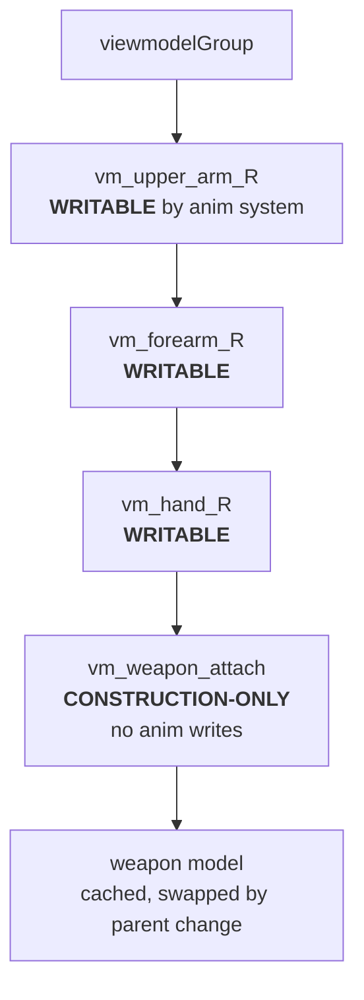

# Viewmodel Architecture

> **Status**: design spec for the FP viewmodel rebuild (parent issue #90).
> **Implementer-facing**: sub-issues #122 (debug toggle), #125 (per-weapon grip data), #129 (inertia + bob + sway) implement against this doc.
> **Source today**: `src/rendering/ViewmodelRenderer.ts`, `src/rendering/ViewmodelAnimationSystem.ts`, `src/animation/ViewmodelAnimationData.ts`, `src/main.ts` (render loop).

This document is the contract for the FP viewmodel system. It captures the architect's design decisions on rendering layout, anchor placement, bone ownership, animation write-permissions, and the math for inertia / locomotion bob / aim-sway lag. The sub-issues that implement against it must follow it precisely; if a deviation is needed, update this doc first.

---

## 1. Two-pass rendering with separate viewmodel camera + Layer 1

The viewmodel renders in a second pass, with its own `PerspectiveCamera` that only sees Three.js render Layer 1. The world scene renders on Layer 0 (the default), so the world camera never sees the viewmodel and the viewmodel camera never sees the world.

### 1.1 Camera parameters

| Camera | FOV | near | far | layers |
|---|---|---|---|---|
| World camera (`World.ts`) | **78** | 0.1 | 1000 | default (Layer 0) |
| Viewmodel camera (`ViewmodelRenderer.ts`) | **65** *(tightened from current 70)* | 0.01 | 5 | `camera.layers.set(1)` |

The narrower FOV on the viewmodel camera makes the weapon feel close and substantial — the canonical FPS look. Tightening from 70 → 65 was an architect call to push the weapon's apparent size up; sub-issue #129 changes the constant.

### 1.2 Two-pass render order

Each frame, after `cameraController.updateCamera(...)`:

1. **Pass 1 — World**: `renderer.render(scene, world.camera)` — renders Layer 0 only (because the world camera's `layers` mask covers Layer 0).
2. Sync viewmodel camera transform to the world camera (`viewmodel.syncWithCamera(world.camera)` — see §7 for the new lag-aware behavior).
3. `renderer.autoClear = false; renderer.clearDepth();` — keep the world color buffer, drop the depth buffer so the viewmodel always passes the depth test (and thus appears in front of world geometry).
4. **`scene.background = null`** — see §1.3.
5. **Pass 2 — Viewmodel**: `renderer.render(scene, viewmodel.camera)` — renders Layer 1 only.
6. Restore `scene.background` and `renderer.autoClear = true`.

### 1.3 The `scene.background` gotcha *(`main.ts:355–362`)*

`THREE.Scene.background` (a sky color or env-map) is rendered as a **full-screen quad before the rest of the scene**, independently of `autoClear`. If we leave it set during Pass 2, that quad paints over the world geometry rendered in Pass 1 and the player sees only the sky color with the viewmodel floating on top.

The fix in `main.ts:355–362` is to null `scene.background` for the duration of Pass 2 and restore it afterward. This is correct, but a workaround — it implies the viewmodel pass touches global scene state, which is exactly the kind of coupling that surprises future contributors.

**Documented follow-up** (out of scope for #115 / #129): move the viewmodel into a **separate `THREE.Scene`** (`viewmodelScene`) owned by `ViewmodelRenderer`. The scene contains only the viewmodel group; Pass 2 renders that scene with the viewmodel camera. No `scene.background` mutation, no Layer 1 needed (or kept defensively). File a sub-issue when the rebuild is otherwise stable.

---

## 2. Anchor convention

The shoulder bone (`vm_upper_arm_R`) sits at the **viewmodel group origin** `(0, 0, 0)`. The arm hangs **down** from the shoulder via negative-Y child offsets — forearm at `(0, -UPPER_ARM_H, 0)`, hand at `(0, -FOREARM_H, 0)` from forearm, weapon attach at `(0, -HAND_H, 0)` from hand.

`ARM_OFFSET = (0.25, -0.10, -0.40)` (camera-local) places the **group origin** — i.e. the shoulder anchor — slightly below and to the right of the eye line. With the arm extending downward from there, the visible geometry naturally enters the viewport from the lower-right corner.

**Do not** raise the shoulder above the group origin. That's the bug fixed in #81 — the upper-arm box clipped into the top third of the viewport.

### 2.1 Anchor diagram

```
                       ARM_OFFSET = (+0.25, -0.10, -0.40)  ◄── camera-local
                                  │
                                  ▼
   Camera eye  ┌─────────────────────────────────────────┐
   (origin)    │                                         │
       ●─────► │                                         │
   forward -Z  │                       world geometry    │
               │                                         │
               │            ●  ◄── group origin = SHOULDER anchor
               │            │      (vm_upper_arm_R at (0,0,0))
               │            │
               │            █   [vm_upper_arm_R]   ◄── hangs DOWN
               │            │
               │            █   [vm_forearm_R]
               │            │
               │            █   [vm_hand_R]
               │            │
               │            ▓   [vm_weapon_attach + weapon model]
               │                                         │
               └─────────────────────────────────────────┘
                                                lower-right of viewport
```

Eye-line (the Camera-eye row in the diagram) is `y = 0` in camera-local space. The shoulder sits at `y = -0.10` (just below the eye), and child bones extend further down via negative-Y offsets, so the entire arm + weapon stays in the lower half of the viewport.

### 2.2 ARM_OFFSET → `ViewmodelTuning` constants module

Today `ARM_OFFSET` is a private const in `ViewmodelRenderer.ts`. After #129 lands, it moves into a new shared module — call it `ViewmodelTuning` (e.g. `src/rendering/ViewmodelTuning.ts`) — alongside the locomotion-bob magnitudes, idle-sway frequencies, and aim-sway time constant. **Don't create the module in #115** (this is a doc-only PR). Sub-issue #129 creates it, so the inertia / bob / sway constants and `ARM_OFFSET` move together.

Rationale: every constant in the module is a visual-tuning knob; a single file is the right home for them, and it lets QA tweak feel without spelunking through render code.

---

## 3. Bone hierarchy + animation write-permissions



Or as ASCII for non-Mermaid renderers:

```
viewmodelGroup
└── vm_upper_arm_R          [WRITABLE by ViewmodelAnimationSystem]
    └── vm_forearm_R        [WRITABLE]
        └── vm_hand_R       [WRITABLE]
            └── vm_weapon_attach   [CONSTRUCTION-ONLY — no anim writes]
                └── <weapon model>
```

**Write-permission contract**:

- `ViewmodelAnimationSystem` may write `quaternion` (and may read/write `position` for breathing offsets) on `upper_arm_R`, `forearm_R`, `hand_R` only.
- `ViewmodelAnimationSystem` **MUST NOT** touch `weapon_attach`. That bone carries the per-weapon grip rotation/offset (see §4) set at construction or weapon-swap time. Any animation write here would override the grip and the weapon would visibly swing relative to the hand.
- The arm-anchor pose is owned by `ARM_OFFSET` (positional) and the per-frame slerp applied to the world camera quaternion (rotational, see §7). The animation system stacks pose + sway on top of that.

Why this split: the grip is a **weapon property** (the longsword tip points one way, the mace head another), but the arm motion is a **player-state property** (windup direction, recovery etc.). Keeping them on different bones makes both independently swappable — change weapons without re-authoring poses, change poses without re-aligning grips.

### 3.1 Bone naming convention

The internal `name` field on each `THREE.Bone` carries the `vm_` prefix (`vm_upper_arm_R`). This makes them disambiguatable from third-person character bones in scene graph dumps, debug overlays, and the `--debug-viewmodel` axis labels.

The `bones` record on `ViewmodelRenderer` exposes those bones **without** the prefix:

```ts
viewmodel.bones.upper_arm_R   // the THREE.Bone whose .name === 'vm_upper_arm_R'
viewmodel.bones.forearm_R
viewmodel.bones.hand_R
viewmodel.bones.weapon_attach
```

This matches the bone keys in `AnimationData.ts` / `ViewmodelAnimationData.ts`, so animation lookup tables work for both third-person and first-person without translation. Future bones added to the viewmodel skeleton must follow the same convention: `vm_<canonical_name>` internally, `<canonical_name>` in the `bones` record. New contributors get this wrong; reviewers should call it out.

---

## 4. Per-weapon grip data

Today, `weapon_attach.rotation.x = Math.PI * 0.85` is hardcoded in `ViewmodelRenderer.ts:162` and applied to every weapon. This is the right angle for the longsword (tip points forward) but wrong for everything else — the mace head, the dagger blade, and the battleaxe sit at the same angle by coincidence rather than design.

### 4.1 `WeaponModelResult` extension

Extend the existing `WeaponModelResult` interface (in `src/rendering/CharacterModel.ts`) with two optional fields:

```ts
export interface WeaponModelResult {
  group: THREE.Group;
  tracerPoints: THREE.Vector3[];
  /** Optional grip translation applied to weapon_attach.position when this weapon is mounted. */
  gripOffset?: THREE.Vector3;
  /** Optional grip rotation applied to weapon_attach.rotation when this weapon is mounted. */
  gripRotation?: THREE.Euler;
}
```

Both fields are optional so existing factories (and any procedural weapons added later) keep working — `ViewmodelRenderer.swapWeapon()` falls back to identity (or the previous hardcoded value during the migration window).

### 4.2 Mount-time semantics

`ViewmodelRenderer.swapWeapon(name)` (after the cache change in §8) does:

1. Look up the cached `WeaponModelResult` for `name`.
2. Detach the previous weapon group from `weapon_attach`.
3. Apply this weapon's grip:
   ```ts
   weapon_attach.position.copy(result.gripOffset ?? ZERO_VEC3);
   weapon_attach.rotation.copy(result.gripRotation ?? new THREE.Euler(Math.PI * 0.85, 0, 0));
   ```
4. Attach the cached group as a child of `weapon_attach`.

The fallback in step 3 preserves current longsword behavior for any weapon that hasn't been re-tuned yet.

### 4.3 Initial tuning values *(starting points only — implementer tunes visually with #122)*

These are starting points for sub-issue #125. They are **not** contracts; the implementer should iterate visually using the `--debug-viewmodel` overlay (#122) and update these in this doc once they feel right.

| Weapon | gripOffset (x, y, z) | gripRotation (x, y, z) | Intent |
|---|---|---|---|
| **Longsword** | `(0, 0, 0)` | `(π·0.85, 0, 0)` | Tip points forward — preserves current behavior. |
| **Mace** | `(0, 0, 0)` | `(π·0.75, 0, -0.15)` | Head angled up-forward — emphasizes the heavy head. |
| **Dagger** | `(0, 0, -0.02)` | `(π·0.90, 0, 0)` | Tighter grip, blade tilted further forward — small/quick feel. Reverse-grip variant possible later (rotate ~π on Z). |
| **Battleaxe** | `(0, -0.05, 0)` | `(π·0.80, 0, 0.1)` | Head heavy, angled slightly down/sideways — sells the weight. |

Note: `weapon_attach` is a child of `vm_hand_R`, so all values are in **`vm_hand_R` local space**. `gripOffset.y < 0` pushes the weapon down toward the hand bottom; `gripRotation.x ≈ π` flips the weapon's local +Y axis (which is the blade direction in factory output) to point forward in camera space. Implementers verifying with the debug axes (#122) should expect the weapon's local +Y to align with the camera's -Z after the rotation.

---

## 5. Idle sway / breathing spec

Subtle motion that signals a living character. **Applied AFTER the slerp blend** in §3 — the breathing offsets layer on top of the pose, not into it. This means the breathing math runs every frame, even mid-attack, but the per-bone amplitudes below are scoped to `Idle` so they don't contaminate combat poses.

Implementation pattern (per bone, in `ViewmodelAnimationSystem.update(dt)`):

```ts
// AFTER the bone.quaternion.slerp(targetQuat, effectiveBlend) line:
if (combatState === CombatState.Idle) {
  _swayEuler.set(swayX, swayY, swayZ, 'XYZ');
  _swayQuat.setFromEuler(_swayEuler);
  bone.quaternion.multiply(_swayQuat);   // post-multiply layers ON TOP of the pose
}
```

Use **mutually-prime frequencies** so the per-bone curves don't synchronize (synchronized sway looks mechanical, like a metronome). Time `t` is a monotonic accumulator in seconds (`elapsedTime += dt`).

### 5.1 Per-bone formulas (Idle only)

| Bone | Axis | Formula | Notes |
|---|---|---|---|
| `upper_arm_R` | Y (yaw) | `sin(t · 2π · 0.35) · 0.012` rad | Breathing — slow chest rise. |
| `upper_arm_R` | X (pitch) | `sin(t · 2π · 0.35 + π/2) · 0.006` rad | Breathing — coupled with Y at quarter-cycle phase shift, half amplitude. |
| `hand_R` | X | `sin(t · 2π · 0.27 + 1.0) · 0.008` rad | Hand drift — independent of breath. |
| `hand_R` | Z | `sin(t · 2π · 0.31 + 2.1) · 0.005` rad | Hand drift — different freq, different phase. |
| `forearm_R` | Z | `sin(t · 2π · 0.40) · 0.004` rad | Forearm sway. |

Frequencies (0.27, 0.31, 0.35, 0.40 Hz) are mutually prime in the sub-Hz range — their LCM is far larger than any session length, so the composite motion never repeats.

Amplitudes are conservative on purpose — `<0.015 rad` is roughly `<1°`. The viewer perceives "alive" rather than "drifting".

### 5.2 Why post-slerp

Doing the sway pre-slerp (i.e. as part of `targetQuat`) means it gets blended away during state transitions and damped out during fast attacks. Doing it post-slerp keeps the sway visible at full amplitude in `Idle` and zero during attacks (because the conditional gates it off). This also avoids a subtle bug: pre-slerp sway would slow when `effectiveBlend < 1` during state-entry crossfade.

---

## 6. Locomotion bob spec

Position-space camera-local offset added to `ARM_OFFSET` before the offset is rotated into world space. Active in **any combat state** when the player is moving — bob is a locomotion signal, not a combat signal.

### 6.1 Inputs

- Player horizontal velocity `v_xz` (read from `MovementComp` — or whatever the rebuild lands on; today it's `Velocity.x`/`Velocity.z` on the player entity, plus the new `MovementState.verticalVelocity` from #104). The implementer of #129 should confirm at impl time which component holds the canonical horizontal velocity.
- `WALK_SPEED ≈ 4 m/s` — full-bob threshold.

### 6.2 Math

```ts
const speed = Math.hypot(velX, velZ);
const targetWalkAmount = Math.min(1, speed / WALK_SPEED);

// Decay walk_amount toward target with ~150ms time constant for smooth start/stop
walkAmount += (targetWalkAmount - walkAmount) * (1 - Math.exp(-dt / 0.150));

// Stride frequency ramps from 1.6 Hz (walking) to 2.6 Hz (sprinting)
const strideFreq = THREE.MathUtils.lerp(1.6, 2.6, walkAmount);
stridePhase += dt * strideFreq;

// Camera-local bob — added to ARM_OFFSET BEFORE applyQuaternion(camera.quaternion)
const bobY = Math.sin(stridePhase * 2 * Math.PI * 2) * 0.012 * walkAmount;  // 2x stride
const bobX = Math.sin(stridePhase * 2 * Math.PI)     * 0.008 * walkAmount;  // 1x stride

const offset = _tmpVec3.copy(ARM_OFFSET);
offset.x += bobX;
offset.y += bobY;
offset.applyQuaternion(worldCamera.quaternion);
this.group.position.copy(worldCamera.position).add(offset);
```

### 6.3 Why this shape

- **Vertical at 2× stride freq** = each footfall (left, right) gives a peak. This is the dominant visual cue.
- **Horizontal at 1× stride freq** = full sway cycle per stride pair, leaning the arm side-to-side as the player's body rocks — emphasizes that the player is the one walking, not the world scrolling.
- **`walk_amount` exponential decay (τ=150ms)** smooths the start (no abrupt bob when keying forward) and the stop (bob settles instead of clipping to zero on release). 150ms matches typical perceived "settle" time for foot motion.
- **Frequencies (1.6 → 2.6 Hz)** map to typical human stride rates (96–156 steps/min). Sprinting feels right at the upper end without becoming cartoonish.

### 6.4 Combat-state interaction

The bob is **independent** of combat state — sprinting through a windup still bobs. This is deliberate: the visual should sell that the player's body is moving, regardless of what their hand is doing. Sub-issue #129 should add a damping multiplier later if attacks feel "loose" mid-sprint, but ship the simple version first.

---

## 7. Aim-sway lag spec

This is the biggest visual fix in the rebuild. Today `syncWithCamera()` does:

```ts
this.group.quaternion.copy(worldCamera.quaternion);
```

— a hard copy. The viewmodel rotates exactly with the camera, frame-perfect. The eye reads this as "the weapon is glued to the screen", which is exactly the 2D-overlay feel we're trying to escape.

### 7.1 Replacement: low-pass filter on rotation

Each frame, slerp the viewmodel's quaternion toward the camera's quaternion with a time-constant-derived blend factor:

```ts
// In ViewmodelRenderer.syncWithCamera(camera, dt)  [signature gains dt]
const tau = 0.080;                              // 80 ms time constant
const alpha = 1 - Math.exp(-dt / tau);          // dt-independent low-pass
this.group.quaternion.slerp(worldCamera.quaternion, alpha);

// Position is still snapped — no positional lag.
const offset = _tmpVec3.copy(ARM_OFFSET);    // (after locomotion bob from §6)
offset.applyQuaternion(worldCamera.quaternion);
this.group.position.copy(worldCamera.position).add(offset);
```

Also slerp the **viewmodel camera** toward the world camera with the same alpha. (Without this, snapping the viewmodel camera but lagging the group would cause the arm to swim in screen space.)

### 7.2 Why 80 ms

- Below ~50 ms, the lag isn't perceptible — feels identical to the rigid copy. Wasted compute.
- Above ~120 ms, the lag becomes noticeable as a "drag" that hurts aim. Players feel like the weapon is fighting them.
- 80 ms is the sweet spot from Counter-Strike / Apex / Mordhau — enough to add weight, not enough to interfere with aim.

The `tau` should live in the `ViewmodelTuning` module (#129) as `AIM_SWAY_TAU_SECONDS`. Tuning past the rebuild is welcome.

### 7.3 Why position is NOT lagged

If position lagged with rotation, the viewmodel would drift when the player runs forward — the camera moves first, the arm catches up, you see a recurring forward-and-back pulse. That's seasickness, not weight. Locomotion bob (§6) is the correct vehicle for positional motion; let position track the camera exactly.

### 7.4 Mouse delta vs. quaternion slerp

A cheaper alternative is to use the per-frame mouse delta directly: `viewmodelCamera.rotateY(-dx * 0.5); viewmodelCamera.rotateX(-dy * 0.5)`. We **don't** do this because:

1. It doesn't compose with non-mouse rotation sources (knockback, hit-react, future controller input).
2. It's frame-rate dependent unless you carefully integrate dt.
3. The slerp form is dt-invariant: at 30Hz vs 144Hz the perceived lag is identical.

Slerp wins.

---

## 8. Weapon swap without per-frame allocation

Today `swapWeapon(name)` calls the factory function, which constructs new geometries, materials, and a new `THREE.Group`. This is fine on equip (rare event, ~once per few seconds at worst) — but the architecture has been creeping toward "factory runs every time a system asks". Pre-warm the cache once, swap by re-parenting only.

### 8.1 Cache shape

```ts
private weaponModelCache: Map<string, WeaponModelResult> = new Map();

constructor(scene, aspect, options) {
  // ... bone hierarchy build ...

  // Pre-warm cache: call each registered factory exactly once
  for (const [name, factory] of Object.entries(options.weaponFactories ?? {})) {
    const result = factory();
    setLayerRecursive(result.group, VIEWMODEL_LAYER);   // do this ONCE
    this.weaponModelCache.set(name, result);
  }

  // Initial weapon
  const initialWeaponName = options.initialWeapon ?? 'Dagger';
  if (this.weaponModelCache.has(initialWeaponName)) {
    this.swapWeapon(initialWeaponName);
  }
}
```

### 8.2 Swap path

```ts
swapWeapon(weaponName: string): boolean {
  const result = this.weaponModelCache.get(weaponName);
  if (!result) {
    console.warn(`ViewmodelRenderer.swapWeapon: no cached model for "${weaponName}"`);
    return false;
  }

  // Detach current
  if (this.weaponGroup) {
    this.weaponAttachBone.remove(this.weaponGroup);
  }

  // Apply this weapon's grip (§4)
  this.weaponAttachBone.position.copy(result.gripOffset ?? ZERO_VEC3);
  if (result.gripRotation) {
    this.weaponAttachBone.rotation.copy(result.gripRotation);
  } else {
    this.weaponAttachBone.rotation.set(Math.PI * 0.85, 0, 0);   // legacy fallback
  }

  // Attach cached group
  this.weaponAttachBone.add(result.group);
  this.weaponGroup = result.group;
  return true;
}
```

Zero allocations on swap. The cached groups stay in memory for the renderer's lifetime; with 4 weapons of ~5 KB geometry each, that's negligible.

### 8.3 Disposal

```ts
dispose() {
  this.group.parent?.remove(this.group);
  this.group.traverse(disposeMeshes);
  for (const result of this.weaponModelCache.values()) {
    result.group.traverse(disposeMeshes);
  }
  this.weaponModelCache.clear();
}
```

`disposeMeshes` is the existing per-mesh geometry+material disposal helper.

### 8.4 What about unique weapon instances per player?

In multiplayer, each remote player has their own viewmodel instance (or none, if their weapon is rendered via the third-person model only — TBD by #92). Each instance has its own cache. Memory cost scales with player count × weapon count, still trivial for ~32 players × 4 weapons.

---

## 9. Render order rules

### 9.1 HUD is fully DOM

All HUD elements (`src/hud/HUD.ts`, `HealthBar.ts`, `StaminaBar.ts`, `DirectionIndicator.ts`, `Killfeed.ts`, `WorldLabel.ts`, etc.) are `document.createElement('div')` overlays positioned with CSS `position: fixed/absolute` and z-index. The browser composites them on top of the canvas — there is no Three.js draw call for HUD.

This means the viewmodel pass only needs to compose against world geometry **inside the canvas**. HUD-vs-viewmodel stacking is handled by the browser's compositor: the viewmodel always renders at the canvas's stacking context, while HUD divs render above the canvas. No coordination required.

`WorldLabel.ts` is the only "world-anchored" HUD piece, but it's still a DOM div that uses `Vector3.project(camera)` to compute pixel coords — it composites above the canvas the same way. The viewmodel doesn't need to know it exists.

### 9.2 Inside-canvas order

Two passes, in this order, every frame:

1. **Pass 1**: world camera renders Layer 0 (world geometry, character meshes, weapons-in-third-person, dummy hitboxes-as-debug, etc.). Writes color + depth.
2. **Pass 2**: depth-buffer cleared (color buffer kept), `scene.background` nulled, viewmodel camera renders Layer 1. Writes color only — the viewmodel is always on top of the world because depth was cleared.

### 9.3 Tracer debug, damage numbers, etc.

`TracerDebugRenderer`, floating damage popups, and the like are on Layer 0 today — they appear in Pass 1 with the world. They compose under the viewmodel, which is correct (you see your weapon in front of damage numbers, not behind them). If a future debug renderer needs to draw on top of the viewmodel, give it Layer 1 and it'll come along for the ride.

### 9.4 The separate-`THREE.Scene` follow-up

As noted in §1.3, moving the viewmodel into its own `THREE.Scene` would eliminate the `scene.background = null` workaround AND make the Layer 1 marking unnecessary (the viewmodel scene would only contain viewmodel objects). It also opens the door to applying viewmodel-specific lighting that doesn't bleed into the world. Out of scope here; flag it as a follow-up.

---

## 10. `--debug-viewmodel` toggle behavior

Spec for sub-issue #122. Listed here so the rest of the rebuild has a known debug surface.

### 10.1 Activation

- **Build flag**: `--debug-viewmodel` query param on the URL (`?debug-viewmodel=1`) or env-driven Vite define.
- **Runtime hotkey**: `F7` toggles on/off live, regardless of whether the flag was set at boot.

### 10.2 What it adds

When enabled:

- **Bone axes**: `THREE.AxesHelper(0.08)` attached as a child of each animatable bone (`upper_arm_R`, `forearm_R`, `hand_R`, `weapon_attach`). Red = X, Green = Y, Blue = Z. Set to Layer 1 so they render with the viewmodel.
- **On-screen pose overlay**: a small DOM div in the bottom-left showing live values:
  ```
  state:    Windup
  dir:      Overhead
  weapon:   Longsword
  weaponId: 0
  phase:    32 / 60 ticks  (53%)
  blend:    0.81
  walkAmt:  0.42
  bobPhase: 7.34
  ```
- **Bone quaternion readout** (optional): each bone's local Euler XYZ in degrees, updated each frame. Useful for visual tuning of grip rotations (§4.3).

### 10.3 What it must NOT do

- Must not alter pose math, blend factors, or apply additional transforms — debug should be an inspection layer, not a behavior change.
- Must not be gated on `process.env.NODE_ENV` — we want it usable in production builds for QA.
- Toggling off must clean up the helpers (so production-build players who hit F7 by accident don't accumulate a bunch of axis arrows).

---

## 11. State publishing contract from Combat FSM

The viewmodel animation system reads exactly five fields per frame from `CombatStateComp[playerEid]` (defined in `src/ecs/components.ts`):

| Field | Type | Meaning |
|---|---|---|
| `state` | `CombatState` enum | Current phase: `Idle / Windup / Release / Recovery / Block / ParryWindow / Riposte / Feint / Clash / Stunned / HitStun`. |
| `direction` | `AttackDirection` enum | For attack/block phases: `Overhead / Left / Right / Stab / Underhand`. |
| `phaseElapsed` | number (ticks) | Ticks elapsed in the current phase. |
| `phaseTotal` | number (ticks) | Total ticks the phase will last. Used to drive `phaseBlend = elapsed/total`. |
| `weaponId` | number | Index into `weaponIdToName` array (today maintained in `CombatSystem.ts`). |

These are **the only fields read**. The animation system MUST NOT poke into raw FSM internals — `fsmRegistry.get(eid)` is forbidden. This decouples the viewmodel from FSM implementation details and lets us swap state machines without touching rendering code.

If sub-issue #88 (Combat FSM v2) reshapes `CombatStateComp` (e.g. unifies it with `CombatStateComponent`, drops `Underhand`, etc.), this section updates with that PR. The doc owns the contract; the contract is the source of truth for the rebuild.

### 11.1 Bone keys must match `ViewmodelAnimationData.ts`

The pose lookup is `getViewmodelPose(weaponName, state, direction)` returning a `Record<BoneName, BoneRotation>`. Bone keys (`upper_arm_R`, `forearm_R`, `hand_R`) match the keys exposed on `ViewmodelRenderer.bones` — see §3.1. Add a new bone, update both files in the same PR.

---

## 12. Bone naming convention reminder

(Repeating §3.1 here under its own heading per the issue's table-of-contents requirement.)

- Internal `THREE.Bone.name` field: `vm_<canonical>` — e.g. `vm_upper_arm_R`. The `vm_` prefix lets you `traverse` the scene and pick out viewmodel bones from third-person bones.
- External `bones` record on `ViewmodelRenderer`: `<canonical>` — e.g. `viewmodel.bones.upper_arm_R`. Matches `AnimationData.ts` keys, so animation code is identical for FP and TP.
- Future bones added to the viewmodel skeleton (e.g. left arm, secondary weapon-attach) MUST follow the same convention.

This is a frequent source of bugs for new contributors: searching for `'vm_upper_arm_R'` in animation data files comes up empty, or searching for `'upper_arm_R'` in the scene graph misses the viewmodel. The convention pays for itself the first time someone debugs a missing pose.

---

## Open questions / follow-ups

- **Separate `THREE.Scene` for the viewmodel** (§1.3, §9.4): file a follow-up after #129 lands.
- **Multiplayer viewmodel instances** (§8.4): how many `ViewmodelRenderer`s do we instantiate? One per local player only? TBD with #92 (networking).
- **Reverse-grip dagger variant** (§4.3): not in #125. File when needed.
- **Damping on locomotion bob during attacks** (§6.4): ship the simple version first; tune in #129.
- **Aim-sway tau per-weapon** (§7.2): consider if heavier weapons should lag more (e.g. battleaxe τ=120ms vs. dagger τ=60ms). Out of scope here.

---

## Cross-references

- Issue #90 (parent — viewmodel rebuild epic).
- Issue #115 (this doc).
- Issue #122 — `--debug-viewmodel` toggle implementation.
- Issue #125 — per-weapon grip data implementation.
- Issue #129 — inertia + bob + sway implementation; creates `ViewmodelTuning` module.
- Issue #81 (closed) — anchor convention fix; `AGENTS.md` "First-Person Viewmodel" section captures the constraints.
- `docs/animation-architecture.md` (#89/#110) — third-person animation rebuild; bone-naming convention shared here.
- `docs/combat-fsm-v2.md` (#88) — combat FSM redesign; if it changes `CombatStateComp` shape, §11 updates with that PR.
